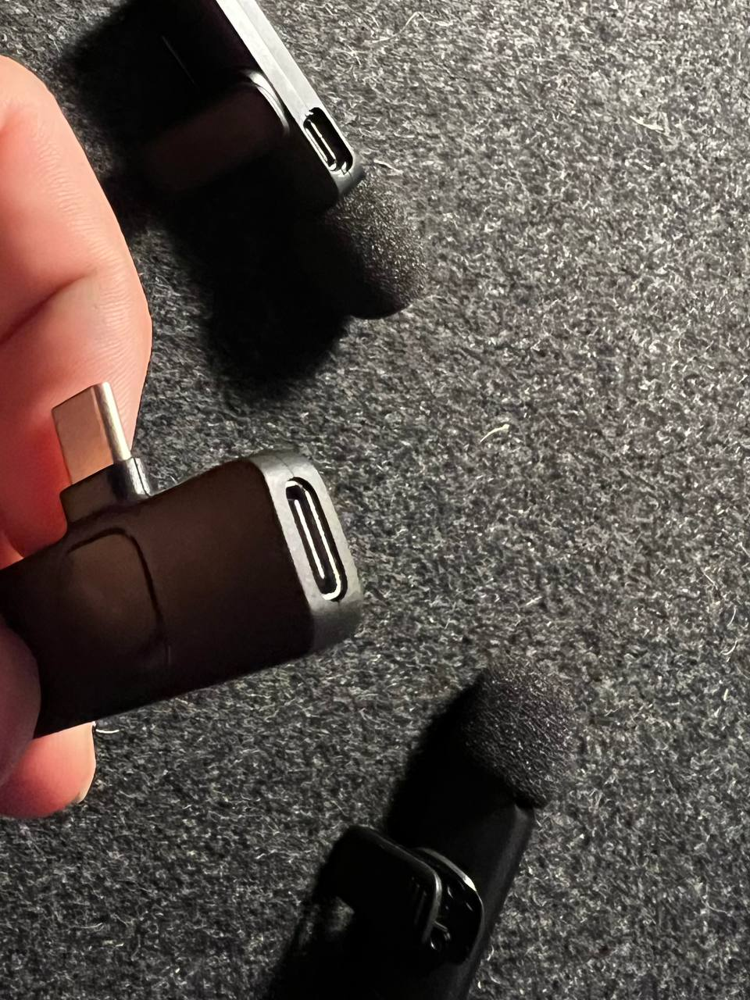

# 🎙️ Audioclast — Real-time USB-C Lavalier Mic Tester for Linux



> *"What I ordered: iPhone-compatible lavalier microphones. What I received: USB-C. What I built: a sonic loopback test suite that could have been a simple bash script but hey why stay there"*

---

## 🧩 Story

Somehow, I ended up winning a free gear promo on one of the Chinese B2C platforms — you know the ones, the digital souks of strange treasures, weird english and incorrect spec sheets.

I picked two USB "L'avalier" mic sets — one single mic, one dual — explicitly asking for **Lightning (iPhone)** versions. What arrived was... **USB-C**. Not a problem for an Android user — which I am not, not yet at least.

Thankfully, my old **Fujitsu Esprimo PC** has one single USB-C port on the front panel. Plugging the mic base, the one that should otherwise be plugged into a phone, in frontapanel usb-c, I noticed something nice: Ubuntu 24.04 + PipeWire recognized the device as a **USB Audio input**.

And so — "Audioclast" was born. Well, actually there was a shell script first but I wanted to have some more options which I'll probably add at some point.

---

## 🚀 What It Does

Audioclast creates a **loopback audio pipeline** from a USB-C mic input to your speakers or headphones, in real time.

- ✔️ Detects your USB lavalier mic (like Jieli, KTS, etc.) - half done, WIP
- ✔️ Routes sound via `arecord` → `sox` (stereo remix) → `aplay`
- ✔️ Log files with rotation and compression
- ✔️ Keyboard-controlled TUI via `textual` (coming soon)

---

## 🛠️ Installation

```bash
git clone git@github.com:ndjuric/audioclast.git
cd audioclast

python -m venv src/.venv
source src/.venv/bin/activate

pip install -r requirements.txt

cd src
python main.py on
```

You should now hear your own voice in your headphones.
If you have a dual-mic receiver (e.g., stereo input), one mic might be left, the other right.

To stop the loopback:

```bash
python main.py off
```

---

## 🧪 Tested On

- ✅ **Ubuntu 24.04**
- ✅ PipeWire + WirePlumber
- ✅ `arecord`, `sox`, `aplay`
- ✅ USB-C lavalier mics (Jieli-based)

---

## 🗂️ Project Structure

```bash
audioclast/
├── src/
│   ├── audioclast.py         # main logic
│   ├── main.py               # CLI entrypoint
│   ├── ui/tui/tui.py         # upcoming TUI
│   ├── vfs/fs.py             # virtual filesystem and log paths
│   ├── logger_setup.py       # rotating log handler
│   └── ...
├── storage/
│   ├── logs/                 # log output (.gz rotated)
│   └── photos/mics.jpg       # visual proof of "what I got"
```

---

## 📦 Features (in progress)

- [x] USB mic detection, but seriously, WIP, needs to be expanded
- [x] Loopback with stereo remixing
- [x] Logging with gzip rotation
- [ ] 🔜 TUI interface with device selection
- [ ] 🔜 Real-time waveform viewer
- [ ] 🔜 Recording to `.wav`

---

## 💬 Contributions

Built by [@ndjuric](https://github.com/ndjuric),  
who just wanted his mics to work.  
Now they do.
If someone actually wants to contribute I mean.. sure thing, just open an issue.

---
